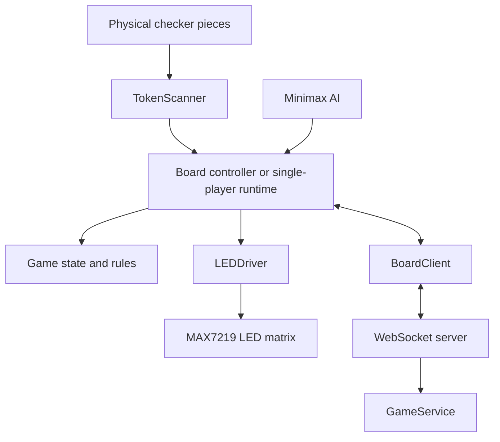

# BetterBoardGame
BetterBoardGame is a physical checkers system built using Raspberry Pi controllers, an 8×8 diode-isolated contact matrix, and MAX7219-controlled LEDs. The software translates physical piece positions into logical game states, validates moves, provides LED guidance, and supports both single-player games against a minimax AI and multiplayer games synchronized over WebSockets.

The hardware interfaces are separated from the game logic through mockable scanner and LED drivers, allowing most of the system to be tested without access to the physical boards.

## System Architecture



## Testing Without Raspberry Pi Hardware

The core game logic, minimax AI, multiplayer protocol, server behavior, and single-player runtime can be tested on a normal computer. Tests that interact with the board use mock scanner and LED drivers instead of Raspberry Pi GPIO and SPI hardware.

Run the mock-compatible automated tests from the repository root:

```bash
python3 -m unittest \
  tests.test_ai \
  tests.test_event_protocol_and_board_client \
  tests.test_game_service \
  tests.test_illegal_moves \
  tests.test_rules \
  tests.test_server_main \
  tests.test_single_player_runtime
```

This currently runs 79 automated tests without requiring the physical boards.

The scanner-to-LED pipeline can also be started using both devices in mock mode:

```bash
python3 tests/run_square_check.py --scanner-mode mock --led-mode mock
```

This verifies that the scanner and LED abstractions can initialize and operate without GPIO or SPI hardware.
