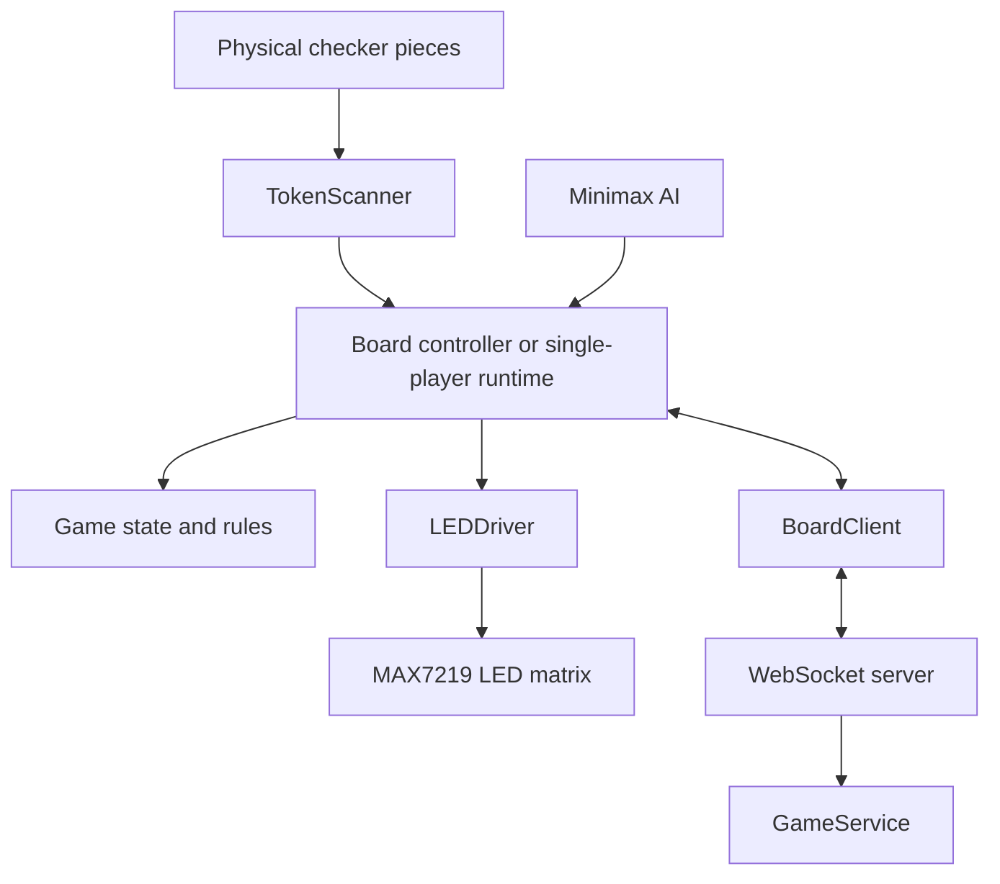

# BetterBoardGame
BetterBoardGame is a physical checkers system built using Raspberry Pi controllers, an 8×8 diode-isolated contact matrix, and MAX7219-controlled LEDs. The software translates physical piece positions into logical game states, validates moves, provides LED guidance, and supports both single-player games against a minimax AI and multiplayer games synchronized over WebSockets.

The hardware interfaces are separated from the game logic through mockable scanner and LED drivers, allowing most of the system to be tested without access to the physical boards.

## Project Images


## System Architecture



### How the System Works

1. When a board powers on, a system service automatically launches the physical-board menu.
2. The player selects single-player or multiplayer mode by placing a piece on the corresponding illuminated square. In single-player mode, the player then selects the AI difficulty on the board.
3. Conductive checker pieces close contacts in an 8×8 diode-isolated matrix.
4. `TokenScanner` reads the GPIO matrix, filters unstable readings, and converts the physical wiring layout into logical board coordinates.
5. The board runtime compares the detected position with the current game state and determines whether a legal move occurred.
6. In single-player mode, the minimax AI selects the opponent’s move. In multiplayer mode, both boards exchange state through an authoritative WebSocket server.
7. `LEDDriver` converts logical feedback into the physical MAX7219 layout. The LEDs communicate menu options, opponent moves, captures, illegal board states, and king pieces.

## Repository Structure

| Directory | Purpose                                                                      |
| --------- | ---------------------------------------------------------------------------- |
| `ai/`     | Minimax search, board evaluation, and difficulty profiles                    |
| `board/`  | GPIO scanning, LED control, startup menu, board runtimes, and network client |
| `server/` | WebSocket server, event protocol, and authoritative game service             |
| `shared/` | Game state, checkers rules, move validation, constants, and serialization    |
| `tests/`  | Automated software tests and physical-hardware diagnostic utilities          |


## Testing Without Raspberry Pi Hardware

The core game logic, minimax AI, multiplayer protocol, server behavior, and single-player runtime can be tested on a normal computer. Tests that interact with the board use mock scanner and LED drivers instead of Raspberry Pi GPIO and SPI hardware.

Run the mock-compatible automated tests from the repository root:

```bash
python3 -m unittest \
  tests.test_ai \
  tests.test_event_protocol_and_board_client \
  tests.test_game_service \
  tests.test_illegal_moves \
  tests.test_rules \
  tests.test_server_main \
  tests.test_single_player_runtime
```

This currently runs 79 automated tests without requiring the physical boards.

The scanner-to-LED pipeline can also be started using both devices in mock mode:

```bash
python3 tests/run_square_check.py --scanner-mode mock --led-mode mock
```

This verifies that the scanner and LED abstractions can initialize and operate without GPIO or SPI hardware.
